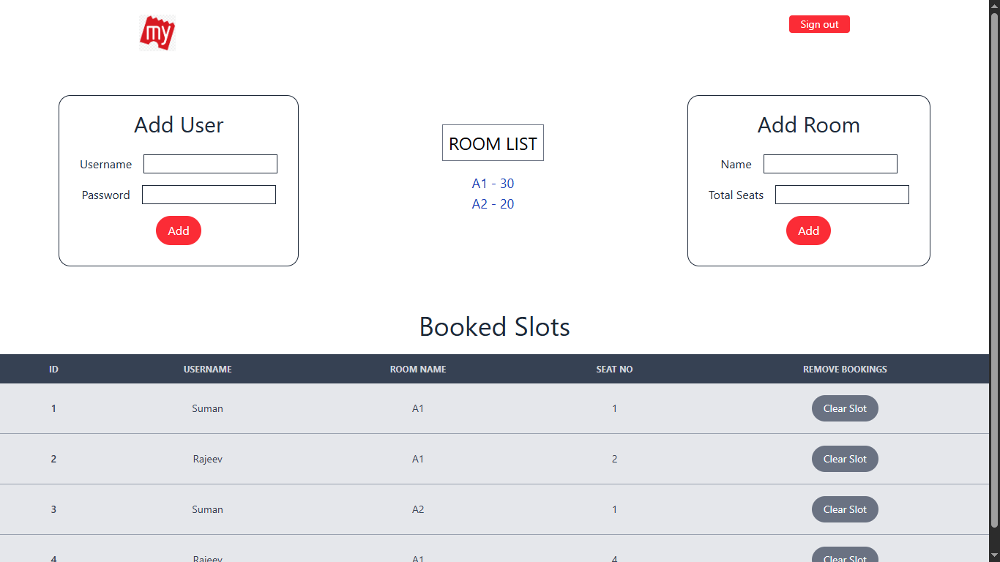

# BookMySeat - Fullstack App

[PostgreSQL Express React Node] -> PERN Stack

# What it is about?

It is a seat booking app where Admin can Create Rooms, Total Seats, Add New Users and Alot them to specific seat of a specific room. Admin can also delete any slot bookings. The Users can only see their own slot bookings. Admin can see all of the users' seat bookings.

## Table of contents

- [Overview](#overview)
  - [The challenge](#the-challenge)
  - [Screenshot](#screenshot)
  - [Links](#links)
  - [Built with](#built-with)
  - [What I learned](#what-i-learned)
  - [Continued development](#continued-development)
- [Author](#author)

## Overview

### The challenge

1. React as front-end, Styling with TailwindCSS, Making it Responsive to Smaller screens
2. NodeJS with Express as back-end
3. Handling Postgres which is a SQL database
4. Using Supabase as the cloud database
5. Connecting supabase to Node through pgAdmin
6. Connecting the front-end with the back-end
7. ..there has been an endless number of challenges

### Screenshot

### Links

- Live Site URL: [https://bookmyseat-suman.vercel.app](https://bookmyseat-suman.vercel.app)

### Built with

-React JS
-Hooks -> useState, useEffect, useLocation, useParams, useNavigate
-TailwindCSS
-NodeJS -> Express, CORS, bodyParser, pg(postgres client)
-RestAPI
-PostgreSQL
-Supabase

### What I learned

The list is endless, just like the challenges were. I have overcome it and learned a lot. This project has been a game changer. This is my first Full-stack web app.

### Continued development

Authentication is something that I am looking forward to learn and implement.

## Author

- Website - [Suman Das](https://github.com/webdevsuman/)
